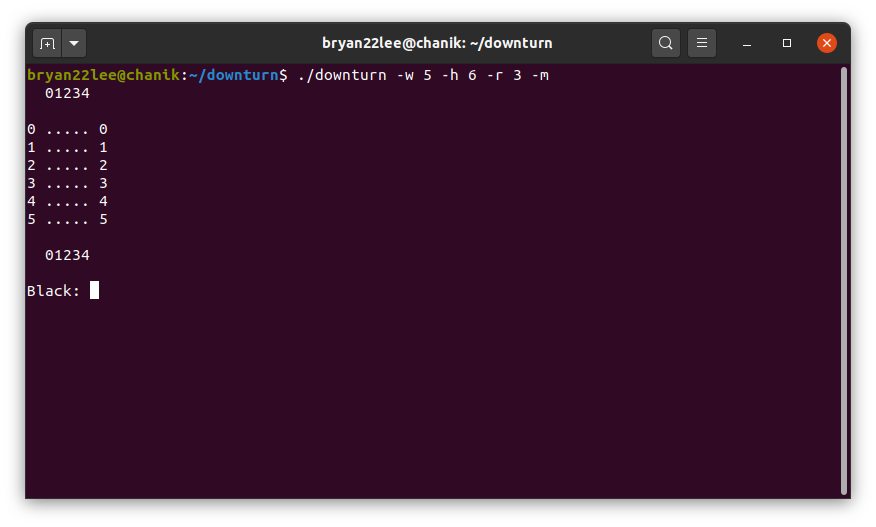

# Downturn
##### Chanik Bryan Lee

Downturn is a variation on Connect 4 such that board rotations are allowed and
gravity is assumed on the pieces (they fall to the bottom-most available row).
The idea of the game is by Professor Wachs at UChicago.
 - Uses ASCII characters for board display in the shell
 
 - `make clean` to remove all executables

## Files:
 - `board.c`/`board.h`: Board data structures, layout
 - `logic.c`/`logic.h`: Moves logic
 - `pos.c`/`pos.h`: Piece position logic/implemntation
 - `play.c`: Gameplay logic for command-line interface
 - `evidence.c`: Unit tests
 - `Makefile`: To compile the executable
 - `README.md`: This file

## Set-up:
 - `make downturn` to create the executable, called **downturn**
 - `./downturn` to run the executable with *additional flags*:
   - `-w <width> -h <height> -r <run>` where `<width>`, `<height>`, and `<run>` should be replaced with integer values
     - `<width>` specifies board width, `<height>` specifies board height,
       and `<run>` specifies the number of pieces in a straight line needed to win (as in Connect 4)
   - Additionally, you must add `-m` (matrix) or `-b` (bits) flags to specify whether you 
     want to run downturn in the *matrix* or *bits* implementation
 - Black starts first. At the prompt, specify a column number to drop a piece into that column.
   - In ASCII, black is represented by character `*` and white is represented by character `o`
 - Or, you can rotate the board *counterclockwise* with `<`, *clockwise* with `>`

## Tests:
 - `make tests` to make an executable with unit tests, called **tests**
 - Run it with `./tests`

## Other:
  - `make` or `make all` to compile both **downturn** and **tests** executables
